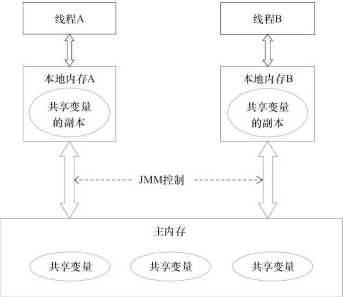

### 并发编程的三个特性
```xml
1.原子性
2.可见性
3.顺序性
```

### happens-before原则
```xml
1.程序顺序规则：一个线程中的每个操作，happens-before于该线程中任意的后续操作
2.监视器锁规则：对一个锁的解锁操作，happens-before于随后对这个锁的加锁操作
3.volatile域规则：对一个volatile域的写操作，happens-before于任意线程后续对这个volatile域的读
4.传递性规则：如果 A happens-before B，且 B happens-before C，那么A happens-before C
```


cpu的内存结构


### JMM定义线程和主寸的抽象关系
线程的共享变量存在主存中，每个线程有一个私有的本地内存，本地内存存储了该线程以读/写共享变量的副本。


线程的工作内存对应于cpu的高速缓存


### volatile 
```xml
1.保证可见性
2.保证顺序性
    保证volatile修饰的变量不需要jvm的优化,前后顺序不能变    
3.不保证原子性
```